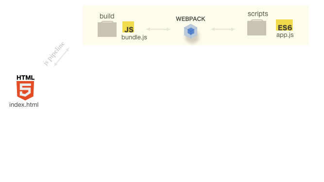

### Steps for installing webpack and configure it for es6

1. choose an entry file like **app.js**
2. ``` npm init ``` to initialize **package.json** file which keeps all your configuration
3. Install webpack: ``` npm install --save-dev webpack@beta ```
4. install babel dependencies: ``` npm i babel-loader babel-core babel-preset-es2015-native-modules --save-dev ```
5. make a config file for webpack ```touch webpack.config.js ```
  * 5.1
  ```javascript
    // load webpack
    const webpack = require('webpack');
    // helps making a production build smaller than dev
    const nodeEnv  = process.env.NODE_ENV || 'production'
    module.exports = {
        devtool: 'source-map',
        entry: {
            filename: './scripts/app.js'
        },
        output: {
            filename: '_build/bundle.js'
        },
        module: {
            // how to handle specific types of files
            loaders: [
                {
                    test: /\.js$/,
                    exclude: /node_modules/,
                    loader: 'babel-loader',
                    query: {
                        presets: ['es2015']
                    }
                }
            ]
        },
        plugins: [
            // uglify js
            new webpack.optimize.UglifyJsPlugin({
                compress: { warnings: false },
                output: { comments: false },
                sourceMap: true
            }),
            // env plugin
            new webpack.DefinePlugin({
                'process.env': { NODE_ENV: JSON.stringify(nodeEnv) }
            })
        ]
    }
   ```
6. make an npm script to run webpack
  * in the package.json file
    * ``` "scripts": {
    "build": "webpack --progress --watch"
  }, ```
